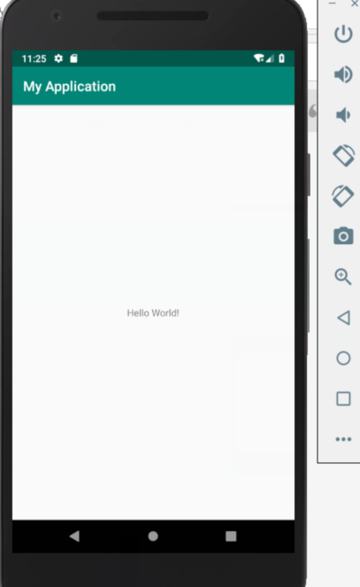

import android.support.v7.app.AppCompatActivity;
import android.os.Bundle;
import android.util.Log;
public class MainActivity extends AppCompatActivity {
	
    @Override
    protected void onCreate(Bundle savedInstanceState) {
        super.onCreate(savedInstanceState);
        setContentView(R.layout.activity_main);
        Log.i("MainMainActivityLife","调用onCreate()");
    }
    @Override
    protected void onStart() {
        super.onStart();
        Log.i("MainMainActivityLife","调用onStart()");
    }
    @Override
    protected void onResume() {
        super.onResume();
        Log.i("MainMainActivityLife","调用onResume()");
    }
    @Override
    protected void onPause() {
        super.onPause();
        Log.i("MainMainActivityLife","调用onPause()");
    }
    @Override
    protected void onStop() {
        super.onStop();
        Log.i("MainMainActivityLife","调用onStop()");
    }
    @Override
    protected void onDestroy() {
        super.onDestroy();
        Log.i("MainMainActivityLife","调用ononDestroy()");
    }
    @Override
    protected void onRestart() {
        super.onRestart();
        Log.i("MainMainActivityLife","调用onRestart()");
    }
}

